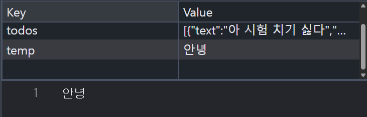

# todolist / shoppinglist의 script 분할
``` html
  <script src="./01_todolist.js"></script>  <!-- body 태그 삽입-->
```
기존 script 태그 내부에 있던 로직들은 전부 01_todolist.js로 잘라내기 - 붙여넣기 하시고 alt _ tab으로 들여쓰기 조정

``` html
<script defer src="./01_todolist.js" ></script>
```
defer : html `<script>` 태그에 사용하는 속성 중 하나로, 스크립트 파일 다운 방식 제어.

defer 사용시에는 웹 페이지의 HTML 파싱을 중단하지 않고 스크립트 로직을 다운, 그리고 다운로드 완료 이후에 HTML 문서의 파싱이 끝나는 시점에 스크립트 실행

- html 문서에 명시된 순서대로 실행 보장.

- 저희 로직이 그렇게 복잡하거나 긴게 아닌데 안되는 건 컴퓨터 문제일 확률이 높아서 그렇습니다. 

# Todolist 복습
localStorage의 저장 방식
key - value 쌍으로 이루어져있고, value에는 다양한 자료형이 들어갈 수 있습니다.

todolist에는 todos라는 ley에 value로 배열이 들어가있고, 배열 내부 요소는 JS 객체 형태로 되어있습니다.

하지만 모든 localStorage의 value가 배열일 필요는 없다는 예시


내일 이후부터 html / css /js 복습을 위한 동영상 강의가 불시에 수강하라고 할 수도 있으니 이어폰 챙겨다니기